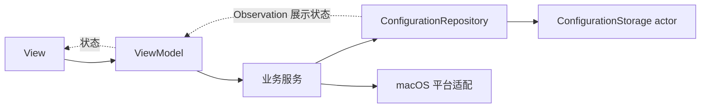

# PhrasePerch 架构

PhrasePerch 使用按功能组织的 MVVM。SwiftUI 渲染主窗口，AppKit 管理原生窗口、径向菜单和授权拖拽卡片。配置由唯一 Repository 持有，界面通过 ViewModel 发起操作。

## 职责与依赖

| 层 | 职责 | 依赖边界 |
| --- | --- | --- |
| `App` | 依赖组装、启动与退出、连接窗口入口 | `AppDependencies` 创建并持有共享实例；`ApplicationCoordinator` 连接生命周期 |
| `Domain` | Codable 数据、校验规则、触发与授权状态机 | 业务规则使用值类型；配置保持现有序列化语义 |
| `Features` | View、ViewModel、组件、布局与动画 | View 展示数据并调用操作入口；ViewModel 管理展示状态并调用服务 |
| `Services` | 编辑、偏好、权限、触发会话、文本插入 | 服务依赖 Repository 和平台接口；窗口交互通过 presentation 协议连接 |
| `Persistence` | 配置状态、自动保存、JSON、备份、入口偏好 | Repository 持有唯一可变配置；文件 I/O 隔离在 actor 中 |
| `Platform/macOS` | AX、剪贴板、粘贴事件、文件选择、系统监控、Dock、菜单栏、登录启动 | 封装原生系统能力与窗口外部交互 |
| `Shared` | 复用界面组件和样式 | 接收展示数据、Binding 和操作闭包 |

独立组件与主要类型分别使用同名文件。功能组件位于所属功能目录，已存在跨功能复用的组件位于 `Shared`。

## 三个独立窗口模块

- **主窗口**：`MainWindowController` 复用同一个窗口；`MainWindowViewModel` 保存导航、应用选择和每个应用的编辑会话。编辑与设置分别由 `ProfileEditorViewModel`、`PreferencesViewModel` 处理。
- **运行时菜单**：`FloatingMenuWindowController` 管理非激活面板；`FloatingMenuViewModel` 保存展示会话与选中状态。`TriggerSessionService` 通过 `FloatingMenuPresenting` 请求展示、查询选中项和收起。
- **授权引导**：`AuthorizationGuideWindowController` 管理独立面板；`AuthorizationGuideViewModel` 保存引导展示状态。授权服务通过 `AuthorizationGuidePresenting` 连接引导。

三个窗口控制器由组装层持有。主窗口关闭后，运行时事件监控继续工作；重新打开主窗口保留编辑会话。

## 编辑与保存

文本控件的 Binding setter 调用 ViewModel，ViewModel 调用 `ProfileEditingService` 按应用 ID、文案 ID 修改配置。应用、文案和偏好修改都进入 `ConfigurationRepository.update`，Repository 对配置变更执行校验、递增修订号并通知独立订阅者。

有效配置使用 400 毫秒防抖保存；未补全的文案保留在内存，补齐后继续保存。字段校验提示和文件操作错误分别展示。异步保存结果只更新对应修订的状态。

`ConfigurationStorage` 是异步持久化接口，生产实现为 `JSONConfigurationStorage` actor。它保留原子写盘、有效备份、损坏文件保留和恢复规则。AX 引用同样保留在 `AccessibilityInputWorker` actor 内。

原生标题与正文控件按文案 ID 区分生命周期，保持 first responder 编辑菜单、输入法、选区与撤销隔离。

## 动画

`FloatingMenuAnimator` 只处理图层变换、透明度与完成通知。`FloatingMenuAnimationConfiguration` 集中定义时长、曲线和收缩比例，`AnimationScheduling` 提供可注入调度器。

默认展开 0.18 秒、收起 0.12 秒，减少动态效果时为 0.08 秒。命中检测使用实际显示图层的位置。动画和菜单展示分别检查当前会话，过期完成回调不会影响新菜单。调优从动画配置和动画实现入手。

## 测试与扩展

测试按 `Domain`、`ViewModels`、`Services`、`Persistence`、`Presentation` 分类；测试替身、预览输出和显式桌面检查入口位于 `Support`。ViewModel 测试使用临时配置或注入存储，动画测试使用手动调度器。

增加功能时，先在所属功能目录定义状态与操作入口，再接入已有服务。新增系统能力通过平台适配接口注入。配置订阅使用 token 注册与注销，功能持有者在结束生命周期时调用 `stop()`。

默认 XCTest 离屏渲染；可见原生检查在 Test Scheme 中设置 `PHRASEPERCH_VISIBLE_UI_TESTS=1`，并让 Test Action 使用自己的环境变量。UI 验证尺寸为 960 × 620、880 × 560、1280 × 800。
