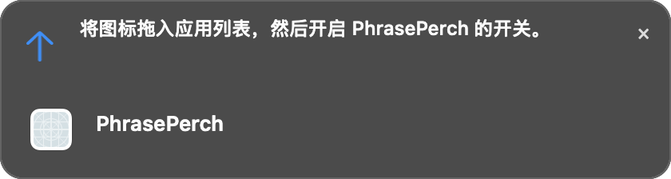

<p align="center"><strong>PhrasePerch 是一款为 macOS 设计的悬浮文案快捷栏</strong></p>

<table>
<tr>
  <td></td>
  <td></td>
</tr>
</table>
<p align="center">
  <a href="#安装与授权"></a>
  <a href="https://www.swift.org/"></a>
  <a href="https://developer.apple.com/documentation/appkit"></a>
  <br>
  <a href="#核心能力">核心能力</a> ·
  <a href="#安装与授权">安装与授权</a> ·
  <a href="#开发">开发</a> ·
  <a href="docs/ACCEPTANCE.md">测试记录</a> ·
  <a href="https://github.com/zhouycheng/PhrasePerch/issues">问题反馈</a>
</p>

## 核心能力

- 为不同应用维护各自的文案按钮，配置保存在本机。
- 默认按住 Option 点击输入框，或按住它拖动选择文字；松开后在鼠标旁显示快捷栏。触发键可改为 Command 或 Shift。
- 也可以录制独立快捷键。规则按应用匹配，浏览器规则覆盖整个浏览器。
- 点击按钮后，PhrasePerch 将文案写入系统剪贴板并投递一次 `⌘V`。剪贴板会被该文案替换并保留，应用不会自动发送内容。
- 快捷栏不激活目标应用，选择文案后淡出；密码框、只读位置和无法确认的输入位置不会写入。

## 安装与授权

项目提供 Apple Silicon 开发构建，最低部署目标为 macOS 14。当前构建使用 ad hoc 签名，尚未公证；macOS 可能要求确认打开应用并单独授予输入权限。

打开设置中的“授权”后，系统会显示输入权限页面和 PhrasePerch 拖动提示。将提示里的应用图标拖入系统应用列表，并开启 PhrasePerch 开关。设置页会自动检查状态。若显示“授权待生效”，点击“重启生效”。

辅助功能和粘贴事件权限都需要可用，快捷栏才会自动粘贴。ad hoc 签名更新可能让 macOS 要求重新授权。应用不修改系统权限开关。

## 数据与剪贴板

文案配置保存在 `~/Library/Application Support/local.FloatingInputBar/`。插入时，剪贴板原内容会被替换；PhrasePerch 不会自动恢复旧内容。每次最多投递一次 `⌘V`，不自动发送，也不重试。

单条文案上限为 64 KiB UTF-8。支持中文、Emoji、Tab 和换行。中文输入法候选文字请先提交，再触发快捷栏。

## 开发

需要 Xcode 27 或兼容的较新 Xcode。依赖 KeyboardShortcuts 3.1.0 已固定在 `Package.resolved`。

打开工程：

```bash
open PhrasePerch.xcodeproj
```

```bash
xcodebuild -project PhrasePerch.xcodeproj -scheme PhrasePerch \
  -configuration Release -destination 'platform=macOS,arch=arm64' \
  -derivedDataPath .build build

xcodebuild -project PhrasePerch.xcodeproj -scheme PhrasePerch \
  -configuration Debug -destination 'platform=macOS,arch=arm64' \
  -derivedDataPath .build test
```

项目结构：

```text
Assets.xcassets/       应用图标
Sources/               AppKit、SwiftUI 与输入逻辑
Tests/                 自动化测试及浏览器输入夹具
Tools/                 剪贴板状态检查工具
Resources/             第三方依赖许可
docs/                  使用验收记录和构建资料
```

## 许可

仓库暂不附 PhrasePerch 代码许可证。KeyboardShortcuts 依赖按 MIT License 发布，许可文本见 [第三方许可文件](Resources/KeyboardShortcuts-LICENSE.txt)。版本为 0.0.1（build 1）。
